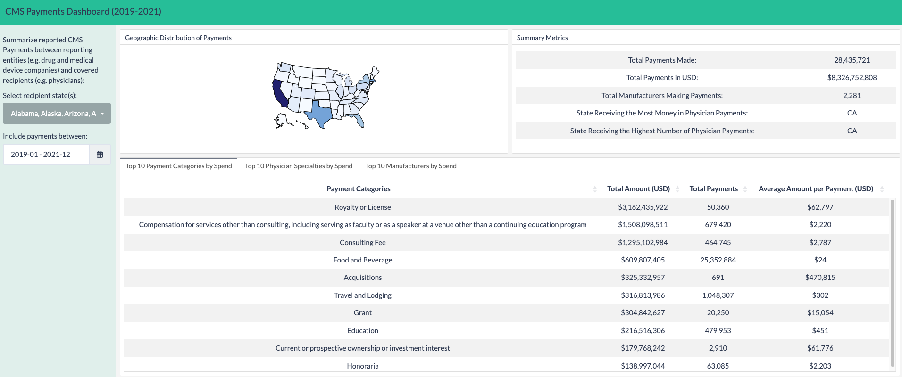

# CMS Open Payments Dashboard (2019-2021)

## Objective

The Centers for Medicare and Medicaid Services (CMS) has established the [Open Payments program](https://www.cms.gov/OpenPayments), an openly accessible database of payments that reporting entities (such as drug and medical devices companies) make to covered recipients (such as physicians, PAs, nurses, etc.). How does Open Payments work? The reporting schedule is as follows:

<p align="center" width="25%">


</p>

The Open Payments database is published annually as a set of large tables. These tables take the form of CSV files and their size and complexity make them particularly cumbersome to work with using localized tools (e.g. the 2021 General Payment Data file is over 11 million rows and 7GB in size) such as MS Excel, R and Python.

In this final project, we demonstrate how several data engineering technologies can be combined to perform the following tasks in for the form of a `data pipeline`:

1.  Download the 2019, 2020, and 2021 Open Payments General Payment datasets from the CMS website

2.  Upload these datasets as smaller (1M row chunks) Parquet files to GCP object storage for accessibility by other cloud-based tools

3.  Push the data to a data warehouse to facilitate fast, structured querying and to transform it into analytic tables for easier analysis

4.  Read the final analytic tables into a data visualization tool to generate a dashboard for summary and exploration

## What technologies are being used?

The following technologies were used to build this data pipeline:

-   Cloud: `Google Cloud Platform`
-   Infrastructure (IaC): `Terraform`
-   Orchestration: `Prefect`
-   Batch Processing: `Python/Pandas`
-   Data lake: `Google Cloud Storage`
-   Data transformation: `dbt`
-   Data warehouse: `Google BigQuery`
-   Data visualization: `R Shiny hosted on Shinyapps.io`

## CMS Payments Dashboard

<p align="center" width="100%">



</p>

The live dashboard can be accessed here: <https://twu13.shinyapps.io/cms_payments/>

The CMS Payments Dashboard was built to leverage the analytic tables generated by this pipeline. The dashboard itself is written in R using the [Shiny](https://shiny.rstudio.com/) and [Flexdashboard](https://pkgs.rstudio.com/flexdashboard/) frameworks and is designed the answer some of the following questions:

-   What are the largest payment categories (e.g. Food and Beverage, Royalty or License, Consulting Fee, etc.) that manufacturers pay physicians for?

-   What physician specialties tend to be paid the most?

-   What manufacturers spend the most money on physician payments?

-   How do these trends and summaries distribute by geography/state?

## Setup

***NOTE:*** *Deployment and modification of the CMS Payments Dashboard itself (via `Shinyapps.io`) is outside the scope of these instructions, which solely cover the management of the data pipeline that feeds into the dashboard. Once the data pipeline is run and the final analytic tables are uploaded to GCS, the dashboard will update by itself without modification.*

1.  **GCP Setup**\
    \
    Create an account and project on Google Cloud Platform and set up a service account with proper privileges for GCP and BigQuery. You can follow the detailed instructions in [`_setup.gcp.md`](https://github.com/twu13/dezoom_2023/blob/main/project/_setup_gcp.md)

2.  **Install Python dependencies**\
    \
    Install all required dependencies into your environment:

``` bash
pip install -r requirements.txt
```

3.  **Prefect Setup**\
    \
    If you are using `Prefect Cloud`, log in to your environment using `prefect cloud login`, otherwise use the ephemeral API or the bundled Orion server to manage Prefect flows

4.  **Use Terraform to create GCP resources**\
    \
    [Install Terraform](https://www.terraform.io/downloads), then run the following commands:

``` bash
cd terraform/
terraform init
terraform plan -var="project=<your-gcp-project-id>"
terraform apply -var="project=<your-gcp-project-id>"
```

5.  **Build Prefect blocks**

    Prefect blocks are used to establish pre-configured credentials for interfacing with GCP services like GCS and BigQuery. You can either run the code in `create_prefect_blocks.py` (fill in your own credentials and block names as directed) or use Prefect Cloud to create them

6.  **dbt**\
    \
    The provided flow relies on the CLI version of `dbt Core` to run data transformations on the CMS Payments data, which is installed as part of the `requirements.txt`. You can also use `dbt Cloud` to run the models within `/dbt` if you prefer

7.  **Run pipeline flow using the command line or via a Prefect agent**

``` bash
python full_pipeline.py
```

8.  **CMS Payments Dashboard**

    The dashboard will automatically read in the latest analytic tables from GCS once the data has been generated
